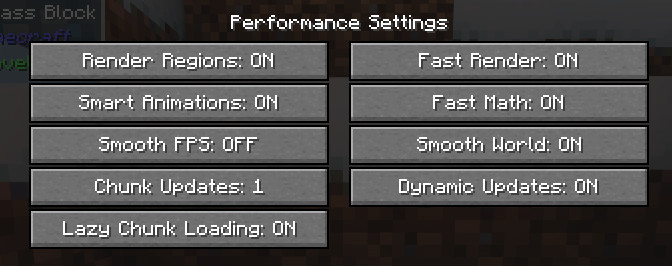

# Trainworld

[Curseforge](https://www.curseforge.com/minecraft/modpacks/trainworld)

## Java Opts

```
-d64 -XX:+DisableExplicitGC -XX:+UseConcMarkSweepGC -XX:MaxGCPauseMillis=80 -XX:+UseStringDeduplication -XX:+UseCompressedOops -XX:+UseCodeCacheFlushing -XX:ParallelGCThreads=4
```

## Minecraft Settings

We recommend to use [OptiFine](https://optifine.net/downloads) (Minecraft Version: 1.16.5) with the following settings located at `Video Settings` -> `Performance`.



If you want more FPS, you can decrease graphics and the animations.
